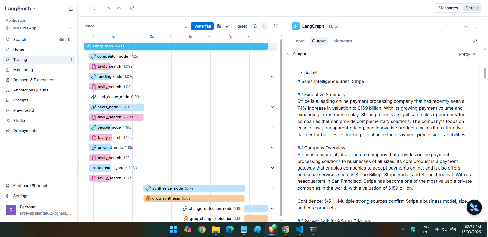

# agent-corp

Give it a company name. It searches the web across 6 different angles simultaneously, pulls everything together with an LLM, and spits out a structured research brief. Built with LangGraph, Tavily, Groq, FastAPI, and Streamlit.

---

## What it does

Type in a company name. The agent kicks off 6 searches in parallel — news, funding, tech stack, competitors, key people, product reviews — waits for them all to finish, then hands everything to Groq/Llama-3.3 to synthesize into a clean brief. It also checks whether the brief actually holds up against the sources it pulled.

---

## How it works

```
company name
      │
      ▼
 LangGraph graph
      │
  ┌───┴──────────────────────────────────────────────┐
  │              all run in parallel                 │
  ▼      ▼       ▼          ▼        ▼      ▼        ▼
load  news  funding  techstack  competitor  people  product
cache  node   node      node       node      node    node
  │      │       │         │           │       │       │
  └──────┴───────┴─────────┴───────────┴───────┴───────┘
                           │
                           ▼
                   synthesize_node
                 (Groq / Llama-3.3-70b)
                           │
                           ▼
                   validation_node
                (grounding + completeness
                     + staleness)
                           │
                           ▼
               change_detection_node
                (diff vs cached report)
                           │
                           ▼
                    brief + changes
```

### The 6 search nodes

| Node              | What it looks for                          | Where it looks                                    | How far back |
| ----------------- | ------------------------------------------ | ------------------------------------------------- | ------------ |
| `news_node`       | Announcements, press releases, launches    | TechCrunch, Reuters, Bloomberg, Forbes, Wired...  | 7 days       |
| `funding_node`    | Funding rounds, investors, valuations      | Crunchbase, PitchBook, Tracxn, SEC filings...     | 90 days      |
| `techstack_node`  | Tech stack, engineering blog, job postings | StackShare, GitHub, dev.to, BuiltWith...          | 180 days     |
| `competitor_node` | Competitors, market positioning            | G2, Capterra, Gartner, SimilarWeb...              | 30 days      |
| `people_node`     | Executives, leadership changes             | LinkedIn, Crunchbase, Forbes, Substack...         | 30 days      |
| `product_node`    | Reviews, user sentiment, pricing           | Product Hunt, G2, Capterra, Reddit, Trustpilot... | 30 days      |

All 6 run at the same time. `load_cache_node` also runs in parallel to grab any previously saved report. `synthesize_node` waits for all 7 before it does anything.

### Validation

After the brief is written, `validation_node` runs three checks:

1. **Source grounding** — takes claims from the *Funding & Growth*, *Key People*, and *Recent Signals* sections and checks each sentence against the actual Tavily sources using Groq. Short sentences and filler phrases get skipped automatically.
2. **Completeness** — makes sure all 6 required sections made it into the brief.
3. **Staleness** — flags any dimension where Tavily came back empty.

The score is `grounded / checked` minus penalties for missing sections (−0.10 each) and empty dimensions (−0.05 each).

### Change detection

Every brief gets cached locally as `cache/<company>.json`. Next time you run the same company, `change_detection_node` compares the fresh news against the old report and calls out anything that actually changed — new funding, leadership moves, product announcements, etc.

---

## Features

- 7 nodes running in parallel (6 searches + cache load)
- Each node targets specific domains relevant to what it's looking for
- Per-section confidence scores (1–5) based on source quality
- Grounding, completeness, and staleness checks with a composite score
- Diffs new results against the cached report
- Source links on every result
- Download the brief as a Markdown file
- Live status cards in the UI that update as each node finishes
- Everything logged with timing and token counts to `logs/agentcorp.log`
- FastAPI backend so the pipeline isn't coupled to the UI

---

## Tech stack

| Layer               | What                                                   |
| ------------------- | ------------------------------------------------------ |
| Agent orchestration | [LangGraph](https://github.com/langchain-ai/langgraph) |
| Web search          | [Tavily API](https://tavily.com)                       |
| LLM                 | [Groq](https://groq.com) + Llama-3.3-70b-versatile     |
| Backend             | [FastAPI](https://fastapi.tiangolo.com) + Uvicorn       |
| UI                  | [Streamlit](https://streamlit.io)                      |
| Tracing             | [LangSmith](https://smith.langchain.com) (optional)    |
| Cache               | Local JSON (`cache/`)                                  |

---

## Getting started

### You'll need

- Python 3.10+
- [Tavily API key](https://tavily.com) — free tier is 1,000 searches/month
- [Groq API key](https://console.groq.com) — free, fast

### Setup

```bash
git clone https://github.com/your-username/agentcorp.git
cd agentcorp

python -m venv venv
source venv/bin/activate        # Mac/Linux
venv\Scripts\activate           # Windows

pip install -r requirements.txt

cp .env.example .env
# add your keys to .env
```

### Environment variables

```env
TAVILY_API_KEY=tvly-...
GROQ_API_KEY=gsk_...

# optional — enables LangSmith tracing
LANGCHAIN_API_KEY=ls__...
LANGCHAIN_TRACING_V2=true
LANGCHAIN_PROJECT=agentcorp
```

### Running it

```bash
streamlit run app.py
```

UI is at `http://localhost:8501`. The pipeline runs directly in the Streamlit process — no separate API server needed for local development.

The FastAPI backend (`api/`) is still there if you want to use it as a standalone API:

```bash
uvicorn api.main:app --reload --port 8000
```

### Deploying to Streamlit Community Cloud

1. Push the repo to GitHub
2. Go to [share.streamlit.io](https://share.streamlit.io) and connect the repo
3. Set the main file to `app.py`
4. Add your secrets in the dashboard under **Settings → Secrets**:

```toml
TAVILY_API_KEY = "tvly-..."
GROQ_API_KEY = "gsk_..."
```

That's it. Streamlit injects secrets as environment variables, so the pipeline picks them up automatically.

---

## API

### `GET /health`

```json
{ "status": "ok" }
```

### `POST /research`

```json
{ "company_name": "Notion" }
```

Returns:

```json
{
  "company_name": "Notion",
  "brief": "## Company Snapshot\n...",
  "changes": "No previous report found.",
  "sources": [...],
  "validation": {
    "is_valid": true,
    "ungrounded_claims": [],
    "incomplete_sections": [],
    "no_data_sections": [],
    "overall_score": 0.95
  },
  "cached": false,
  "timestamp": "2024-01-15T10:30:00"
}
```

### `GET /research/{company_name}`

Returns the cached report for a company, or 404 if there isn't one.

---

## Project structure

```
agentcorp/
├── app.py                      # Streamlit UI
├── requirements.txt
├── .env.example
│
├── agent/
│   ├── graph.py                # LangGraph graph (10 nodes)
│   ├── nodes.py                # all nodes: search, synthesis, validation, change detection
│   ├── prompts.py              # LLM prompts
│   └── state.py                # AgentState TypedDict
│
├── api/
│   ├── config.py               # env var settings (Pydantic)
│   ├── main.py                 # FastAPI endpoints
│   └── schemas.py              # request/response models
│
├── utils/
│   ├── cache.py                # save/load/check local JSON cache
│   ├── export.py               # confidence score parser + Markdown export
│   ├── logger.py               # logging setup (RotatingFileHandler)
│   ├── tracing.py              # LangSmith helpers
│   ├── validation_result.py    # ValidationResult dataclass
│   └── validator.py            # grounding, completeness, staleness checks
│
├── tests/
│   └── test_nodes.py           # integration tests for all 6 search nodes
│
├── cache/                      # auto-created, gitignored
├── logs/                       # auto-created, gitignored
└── img/
    └── LangSmith.png
```

---

## Tests

Tests make real Tavily calls using "Notion" as the test company. You need `TAVILY_API_KEY` set in `.env`.

```bash
pytest tests/test_nodes.py -v -s
```

Each test prints how many results came back and what the first one was.

---

## Observability

Set `LANGCHAIN_TRACING_V2=true` and every run gets traced in LangSmith — you can see exactly what each node did, how long it took, and how many tokens were used.



---

## Logging

Everything goes to `logs/agentcorp.log` (rotating, 5 MB × 3 backups) and the console.

Tavily calls log the query, domains, time window, result count, and how long the request took.

Groq calls log prompt tokens, completion tokens, and elapsed time.

If a brief scores below 0.70 on validation, it logs at WARNING level.

---

## What the brief looks like

Six sections, each with a confidence score (1–5):

- **Company Snapshot** — what they do, how big they are, what stage they're at
- **Recent Signals** — what's happened lately worth knowing about
- **Tech Stack** — what they're built on, what they're hiring for
- **Funding & Growth** — rounds, investors, growth trajectory
- **Key People** — who's running the place, recent changes
- **Product Sentiment** — what users actually think, pricing, complaints

---

## Costs

A typical run is ~12 Tavily searches and ~22 Groq calls (synthesis + change detection + up to 20 grounding checks).

| Service              | Per run                        | Cost                   |
| -------------------- | ------------------------------ | ---------------------- |
| Tavily               | ~12 searches                   | free tier: 1,000/month |
| Groq (Llama-3.3-70b) | ~8k tokens in / ~5k tokens out | free tier available    |

---

## Known limitations

- Tavily free tier caps at 1,000 searches/month
- Smaller or less-covered companies will get fewer results
- Change detection only diffs the news dimension, not all 6
- Cache is local only — nothing shared across machines
- No auth, no multi-user support
